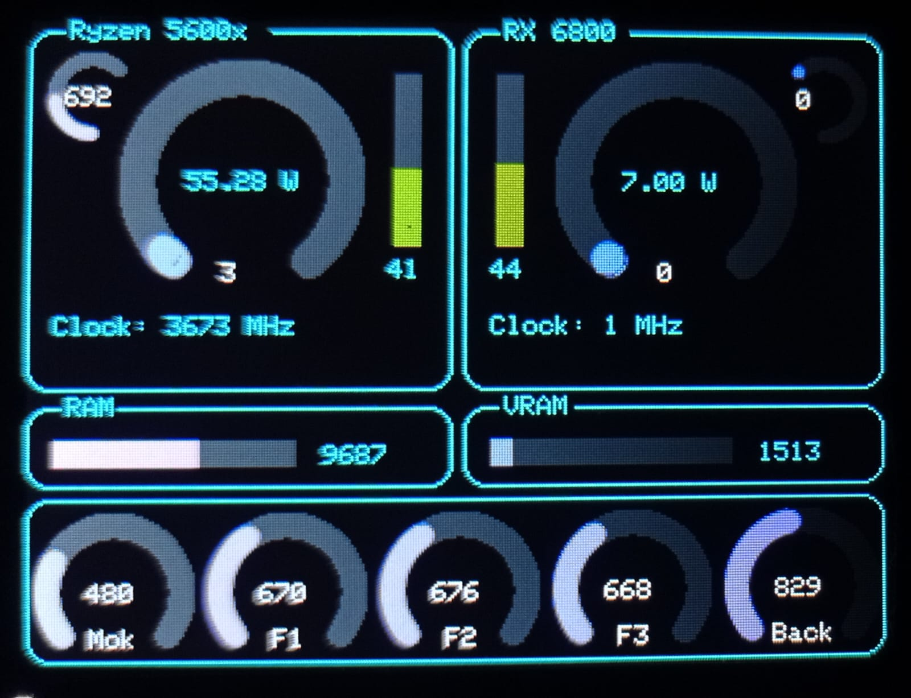

# ESP32_PC_Monitor
Works on windows
Read AIDA64 data and display it to a TFT screen

### Aida64
File > Preferences > External Applications
> Check "Enable shared memory"
Then check the values you want to send to the monitor

### Arduino
Compile the sketch for ESP32
I use the TFT_eSPI lib that must be configured as you need
Check "User_Setup.h"

The code can be adapted to whatever you need

### Windows
Compile from "srcs" :
`g++ main.cpp aida.cpp serial.cpp -o esp_aida`
And run .exe from cmd

### Work in progress....

