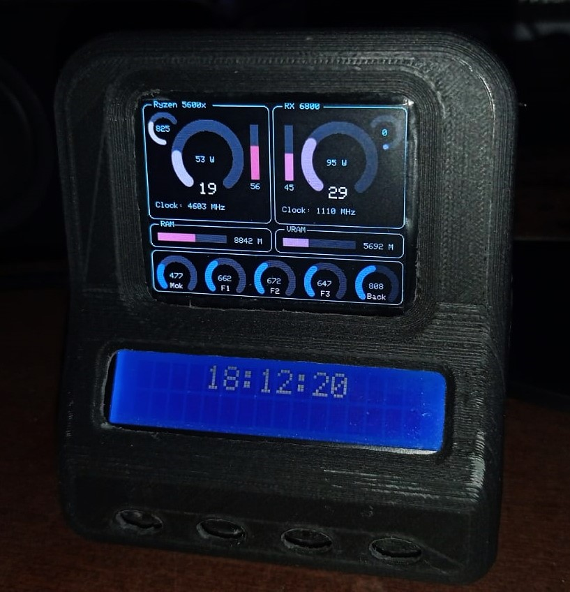

# ESP32_PC_Monitor
Works on windows
Read AIDA64 data and display it to a TFT screen

### Aida64
File > Preferences > External Applications
> Check "Enable shared memory"
Then check the values you want to send to the monitor

### Arduino
Compile the sketch for ESP32

I use the TFT_eSPI lib that must be configured as you need, Check "User_Setup.h"

I am using a Waveshare 320 x 240 tft display here and a LCD connected using SPI

The code will probably have to be adapted to your hardware, and the UI you wish yo have

## Windows
Compile from "srcs" :
`g++ main.cpp aida.cpp serial.cpp -o esp_aida`

And run .exe from cmd
`esp_aida.exe COM3 [debug=0/1]`

### Windows UI
You might be able to use the UI I made using QT. It's my first app so it might have some bugs..

Check in the releases

The program is configured to work with my arduino code, but you can modify the settings to your convenance

Serial ID is the identifier that will be send to the serial datas, which is a string formatted like :

CPUfan:650;CPUpower:40;CPUtemp:55;CPUuse:35; ..... ;RAMuse:8650;\n

### Work in progress....

